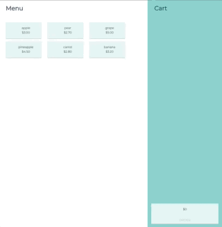
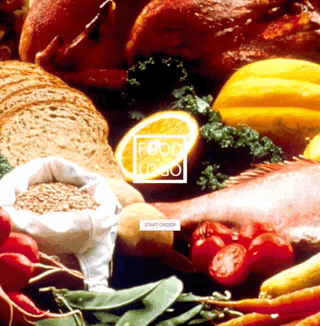

# Food Content Management System

[Demo](https://senhungwong.github.io/content-management-system/)
## Features

**New Features:**

 - Router navigate pages
 - Show menu and cart items
 - Add/Subtract/Remove menu item to cart
 - Order Modal

**In Coming Features:**

 - User Login/Register Page

## v0.1.1



## v0.1.0



## Build

``` bash
# install dependencies
npm install

# serve with hot reload at localhost:8080
npm run dev

# build for production with minification
npm run build

# build for production and view the bundle analyzer report
npm run build --report
```

For a detailed explanation on how things work, check out the [guide](http://vuejs-templates.github.io/webpack/) and [docs for vue-loader](http://vuejs.github.io/vue-loader).
